# 🍬 Candy

> 💡 NOTA:  En mi [repositorio dockerlabs](https://github.com/damcorbor/dockerlabs/tree/main/comandos)  suelo ir dejando una lista con los comandos, herramientas y servicios que he ido usando durante los laboratorios, y los explico un poco por si alguien quiere repasarlos o usarlos como referencia.
---

## 🕵️ Reconocimiento

Lo primero es lanzar un escaneo con **nmap** para ver qué puertos y servicios están disponibles.

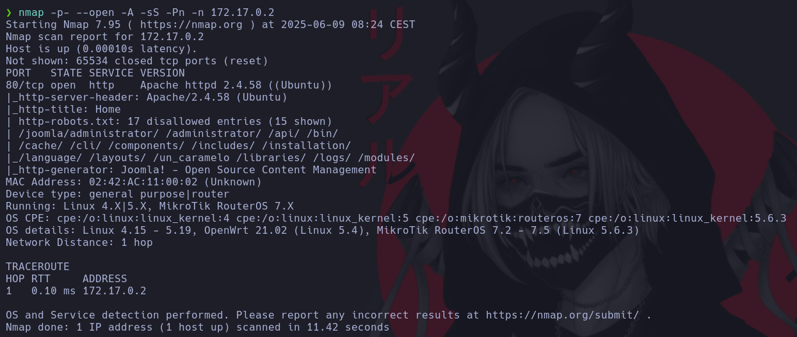

Solo encontramos el puerto **80 (HTTP)** abierto.

## 💥 Explotación

Accedemos a la web y lo primero que aparece es un formulario de login. Probamos varias inyecciones SQL, pero sin éxito.

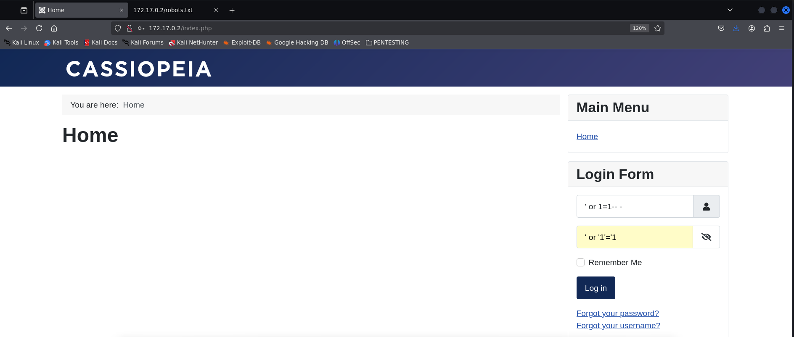  

Lanzamos entonces un **gobuster** para intentar descubrir directorios ocultos.

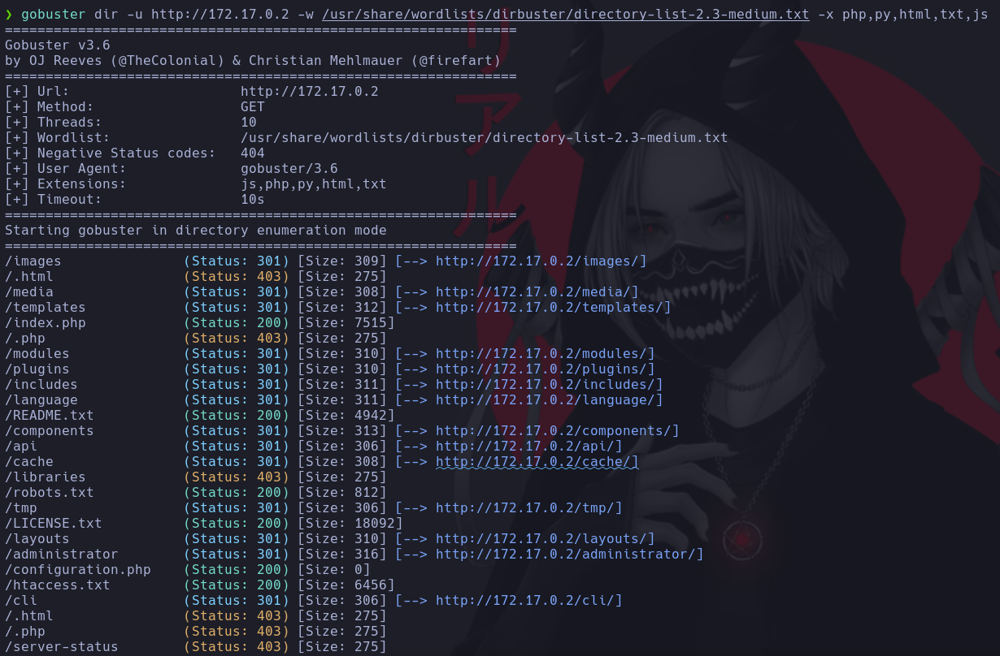

Entre los resultados aparece `/robots.txt`, y al final del archivo se puede ver lo que parece un usuario (`admin`) y una contraseña hasheada.

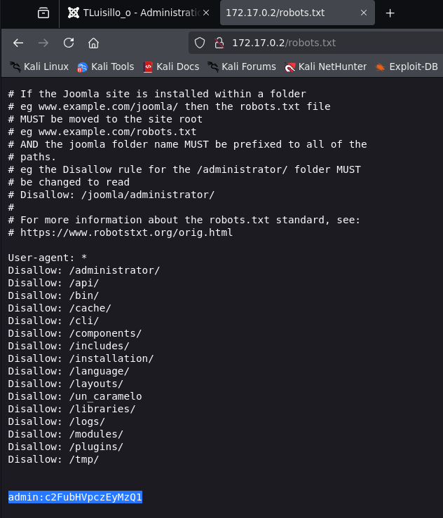

Desciframos el hash (era simplemente en base64).

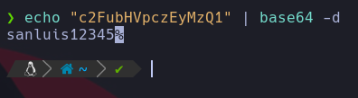

Con estas credenciales conseguimos acceder al panel de administración de Joomla.

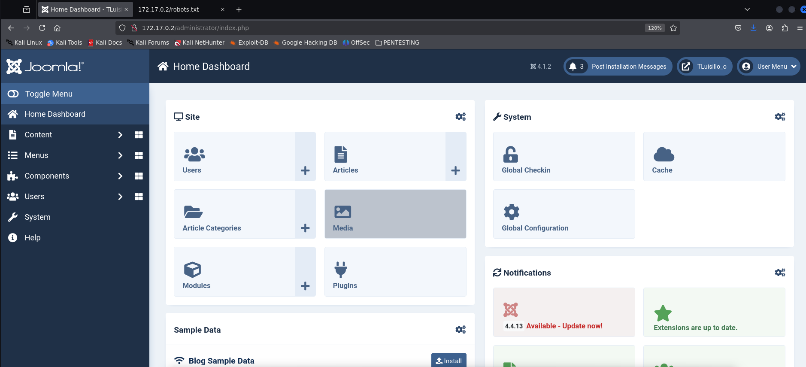

Desde ahí buscamos alguna forma de modificar código para inyectar una **reverse shell**. Lo hacemos dentro del contenido del index.php.

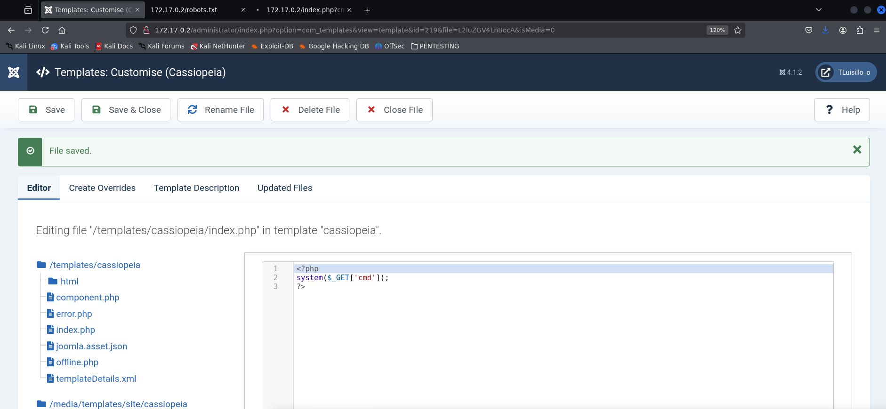

Ponemos a escuchar el puerto **3344** a la espera de la conexión.

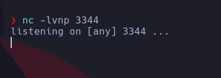

Visitamos la página modificada, disparando la reverse shell mediante el parámetro `cmd`.

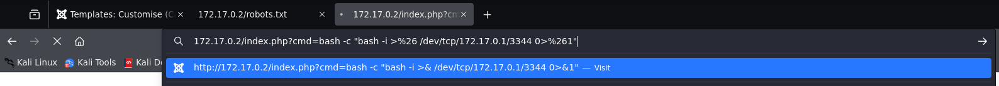

Una vez obtenida la shell, se hace el tratamiento de TTY para trabajar de forma más cómoda.

## ⬆️ Escalada de privilegios

Investigando un rato se localiza un archivo `.txt` con información sensible.

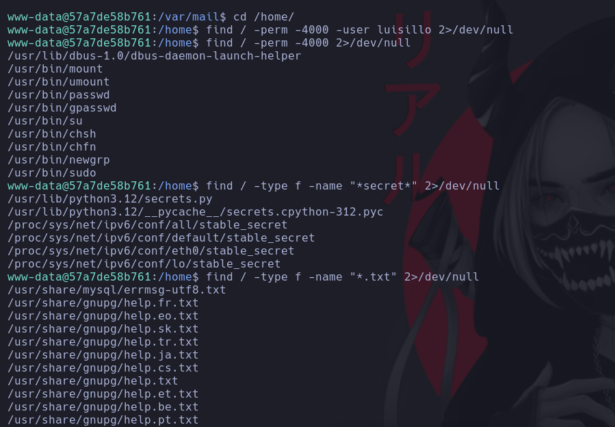  
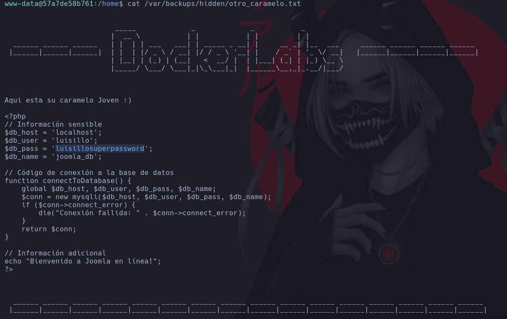

Ahí se encuentra un nuevo usuario (**luisillo**) junto con su contraseña: `luisillosuperpassword`.

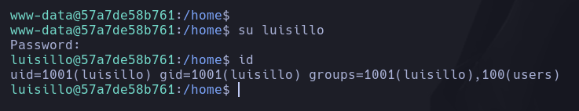

Accedemos como **luisillo** y lanzamos `sudo -l`. Vemos que puede ejecutar el binario **dd**.

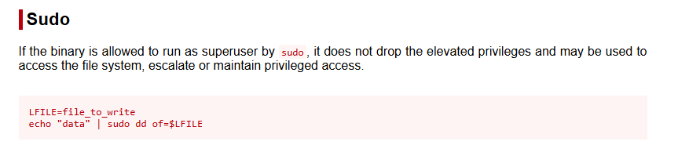

Con ayuda de **GTFOBins**, aprovechamos esto para escalar privilegios. El binario `dd` se puede usar para sobrescribir archivos, así que copiamos `/etc/passwd`, editamos localmente quitando la `x` al usuario root (dejando sin contraseña), y luego lo restauramos.

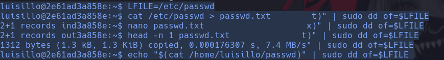  
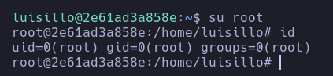

## 🏁 Conclusión

Este laboratorio permite practicar una cadena completa de ataque. Se ha trabajado:

- Acceso a un panel vulnerable de **Joomla** usando credenciales descubiertas en `robots.txt`.
- Inyección de una **reverse shell** mediante modificación de código web.
- Movimiento lateral hacia el usuario **luisillo** usando información expuesta en texto plano.
- Escalada de privilegios con el binario **dd**, sobrescribiendo el archivo `/etc/passwd` para obtener acceso como root.

---

