# 🖥️ Consolelog

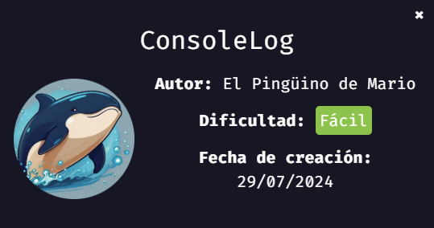
> 💡 NOTA:  En mi [repositorio dockerlabs](https://github.com/damcorbor/dockerlabs/tree/main/comandos)  suelo ir dejando una lista con los comandos, herramientas y servicios que he ido usando durante los laboratorios, y los explico un poco por si alguien quiere repasarlos o usarlos como referencia.
---

## 🕵️ Reconocimiento

Arrancamos con un escaneo usando **nmap** para ver qué puertos y servicios están activos.

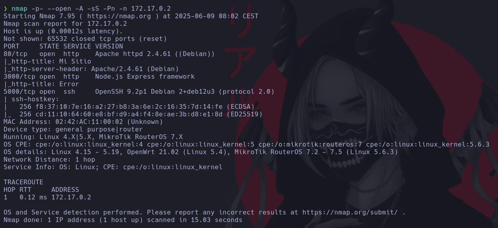

Detectamos los puertos **80 (HTTP)**, **3000 (HTTP)** y **5000 (SSH)** abiertos. Ejecutamos dos **gobuster**, uno para el puerto 80 y otro para el 3000, buscando posibles directorios ocultos.

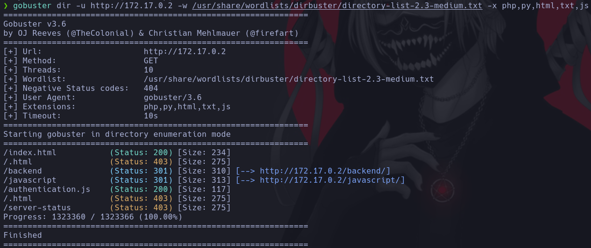  
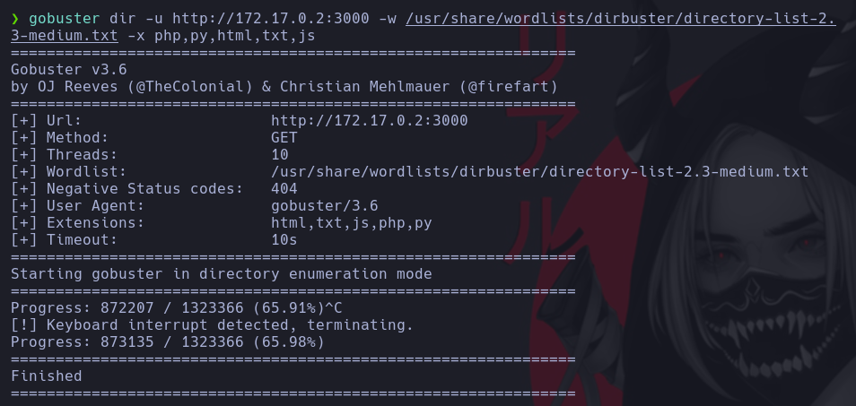

Accedemos a la web principal (puerto 80) y no muestra nada especialmente útil.

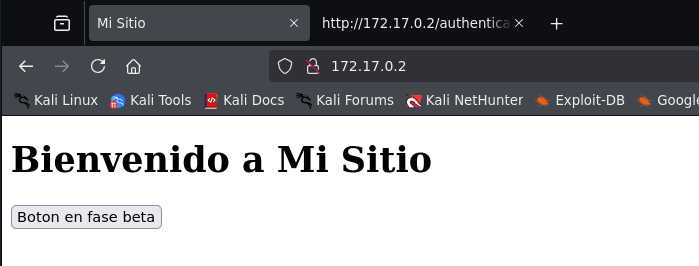

Echando un vistazo al código fuente aparece un JS relacionado con autenticación.

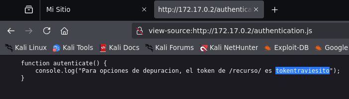

Navegando un poco más llegamos al directorio `/backend`, donde hay un archivo `.js` que contiene lo que parece ser una contraseña.

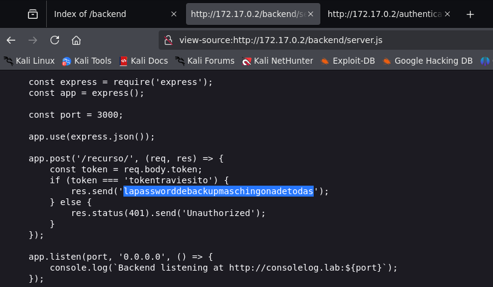

## 💥 Explotación

Con la contraseña, lanzamos un ataque de fuerza bruta con **Hydra**. Usamos un diccionario de nombres de usuario y la contraseña encontrada antes.

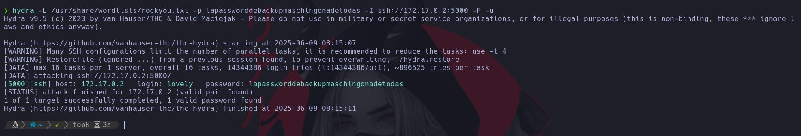

Hydra devuelve un acceso válido con el usuario **lovely**, así que probamos a conectarnos por SSH.

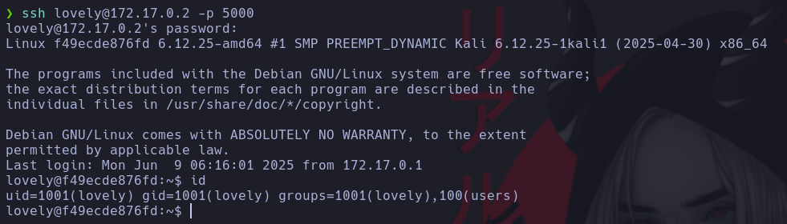

## 🧗 Escalada de privilegios

Lanzamos `sudo -l` para ver qué binarios se pueden ejecutar con privilegios elevados.

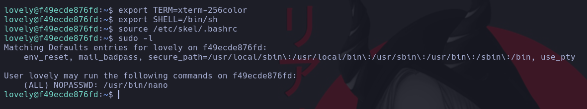

Vemos que el usuario puede ejecutar **nano** como cualquier otro usuario, sin necesidad de contraseña. Usando **GTFOBins**, aprovechamos esto para escalar privilegios.

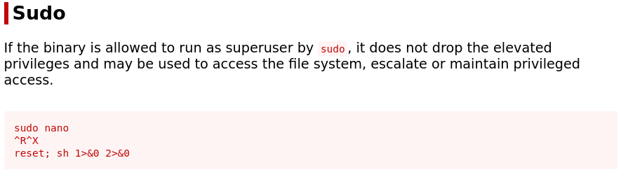  
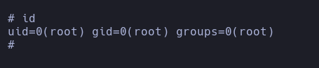

Máquina comprometida 🔓

---

## 🏁 Conclusión

En este reto hemos visto:

- Descubrir directorios y archivos interesantes a través de fuerza bruta con **gobuster**.
- Encontrar credenciales en código JavaScript expuesto en la parte web.
- Obtener acceso inicial mediante **fuerza bruta por SSH** con **Hydra** y las credenciales encontradas.
- Enumerar permisos con `sudo -l` y aprovechar la ejecución de **nano** como cualquier usuario para **escalar privilegios** a root usando técnicas de **GTFOBins**.

