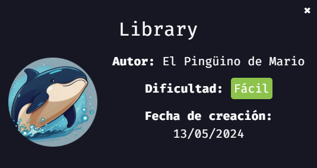
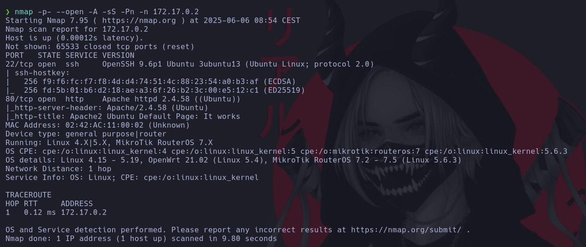
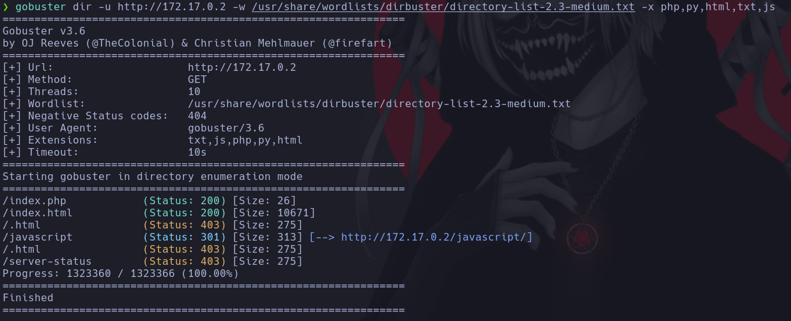
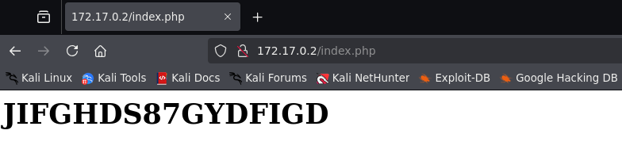
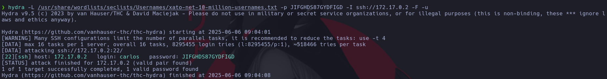
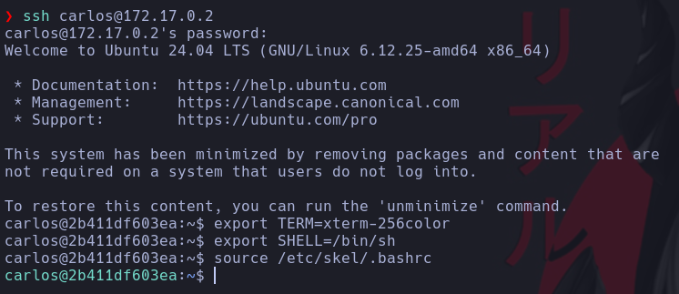
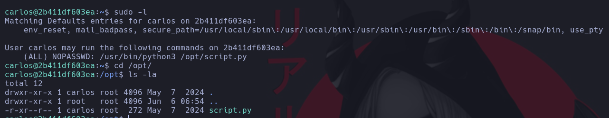
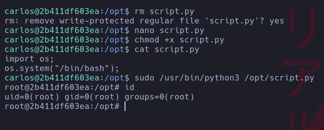

# 📚 Library

> 💡 NOTA:  En mi [repositorio dockerlabs](https://github.com/damcorbor/dockerlabs/tree/main/comandos)  suelo ir dejando una lista con los comandos, herramientas y servicios que he ido usando durante los laboratorios, y los explico un poco por si alguien quiere repasarlos o usarlos como referencia.
---

## 🔍 Reconocimiento

Empezamos con `nmap` para ver puertos y servicios abiertos.

Vemos abiertos el puerto **80** y el **22**. Como no tenemos credenciales para el 22, pasamos al puerto 80.

Al acceder al puerto 80 vemos que es una página por defecto de Apache2. En el código fuente no encontramos nada interesante, así que realizamos un *fuzzing* web para detectar posibles directorios ocultos.

Encontramos un `index.php`. Al acceder a él, vemos lo que parece ser una contraseña.

---

## 💥 Fase 2 - Explotación

Vamos a probar un ataque de fuerza bruta por SSH utilizando un diccionario de usuarios y la contraseña obtenida.

Perfecto, encontramos un usuario llamado **carlos**. Accedemos vía SSH y ajustamos la terminal.

---

## ⚙️ Escalada de Privilegios

Como de costumbre, usamos `sudo -l` para ver qué podemos ejecutar con sudo.

Vemos que podemos ejecutar como cualquier usuario (incluido root) un script ubicado en `/opt`, sin necesidad de contraseña. Accedemos al script y revisamos los permisos.

Aunque solo tenemos permiso de lectura y ejecución, notamos que **el propietario del script somos nosotros mismos (carlos)**, por lo que podemos borrarlo y crear uno nuevo con el mismo nombre.

Creamos un script personalizado, le damos permisos de ejecución y lo ejecutamos con sudo.

Máquina comprometida 🔓

---

## 🏁 Conclusión

En este reto hemos visto:

- Cómo identificar servicios expuestos mediante un escaneo de puertos con `nmap`.

- Cómo descubrir rutas ocultas en una web usando *fuzzing* con `gobuster`.

- Cómo aprovechar una contraseña expuesta en una web para realizar un ataque de fuerza bruta por SSH con `hydra`.

- Cómo escalar privilegios utilizando `sudo` para ejecutar un script como cualquier usuario, incluyendo root, gracias a los permisos mal configurados.

- Y cómo abusar del hecho de ser propietarios de un archivo ejecutable para reemplazarlo y obtener acceso como root.
