# 📦 Move

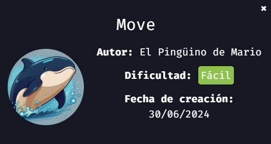
> 💡 NOTA:  En mi [repositorio dockerlabs](https://github.com/damcorbor/dockerlabs/tree/main/comandos)  suelo ir dejando una lista con los comandos, herramientas y servicios que he ido usando durante los laboratorios, y los explico un poco por si alguien quiere repasarlos o usarlos como referencia.
---

## 🕵️ Reconocimiento

Empezamos con un escaneo con **nmap** para identificar los servicios expuestos.

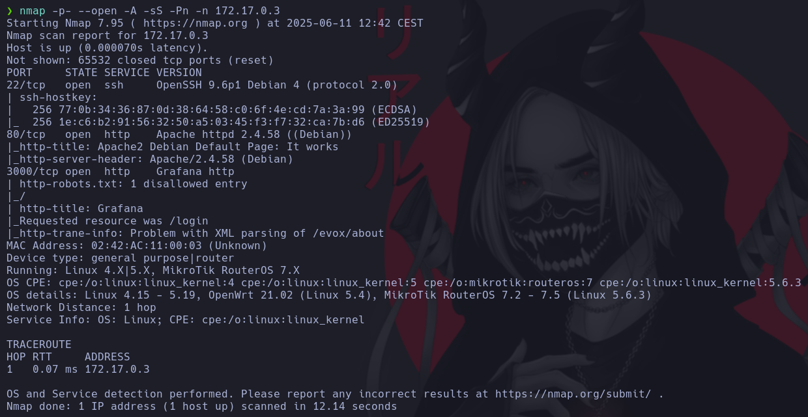

Se detectan los puertos **22 (SSH)**, **80 (HTTP)** y **3000 (HTTP)**.  

De momento, sin credenciales poco se puede hacer con SSH, así que nos centramos en los servicios web.

Al entrar por el puerto **80**, aparece la página por defecto de Apache sin nada útil, ni siquiera en el código fuente.

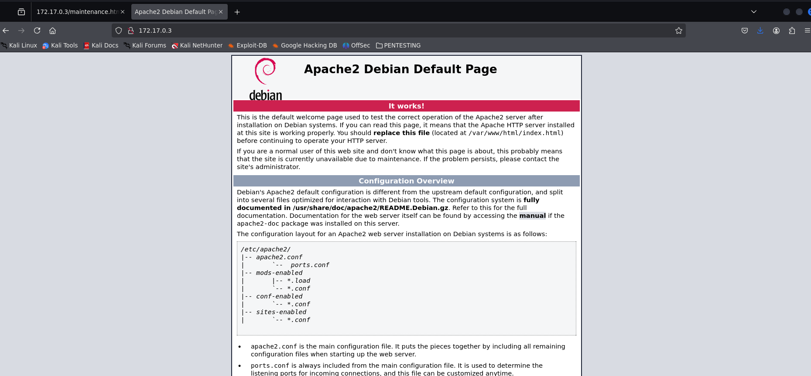

Lanzamos un **gobuster** para ver si hay rutas ocultas.

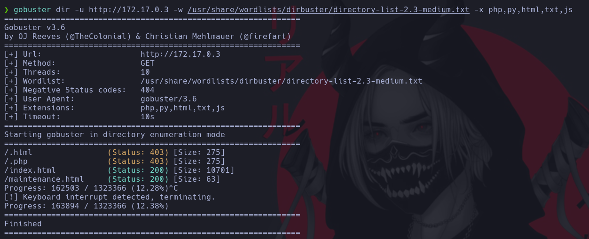

Se encuentra un archivo en `/maintenance.html`.

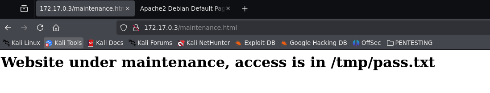

Dentro, aparece el siguiente mensaje:

> **Website under maintenance, access is in /tmp/pass.txt**

Esto lo dejamos apuntado para más adelante, podría ser útil.

Pasamos ahora a ver qué hay en el puerto **3000**, donde encontramos un panel de **Grafana**.

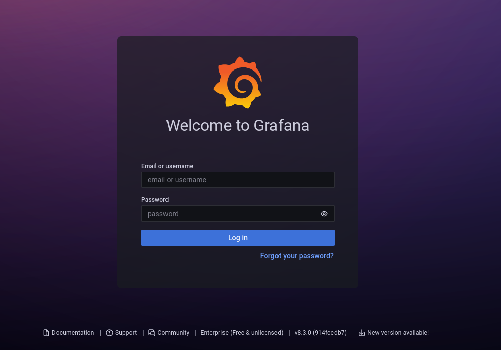

Probamos con las credenciales por defecto `admin:admin`, y funciona. Una vez dentro del dashboard, comprobamos la versión de Grafana que está corriendo.

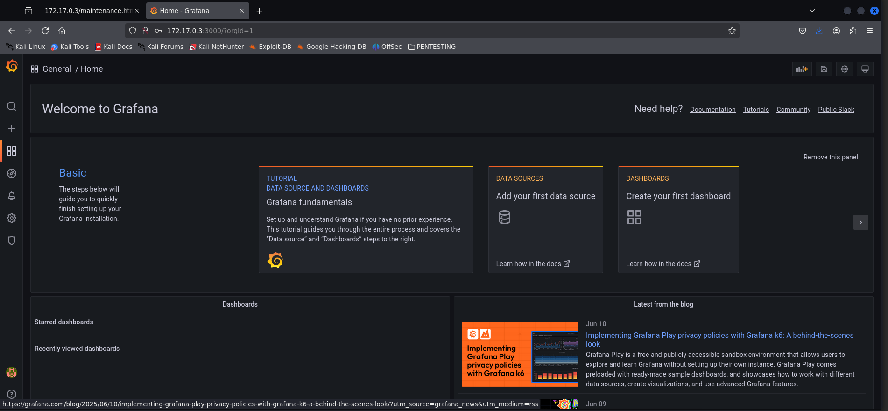

Buscamos vulnerabilidades relacionadas con esa versión usando **searchsploit**.

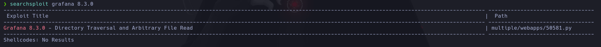

Se encuentra un exploit que permite leer archivos del sistema. Lo copiamos a nuestra máquina.

---

## 💥 Explotación

Usamos el exploit para leer el archivo `/tmp/pass.txt` mencionado anteriormente, además de `/etc/passwd`.

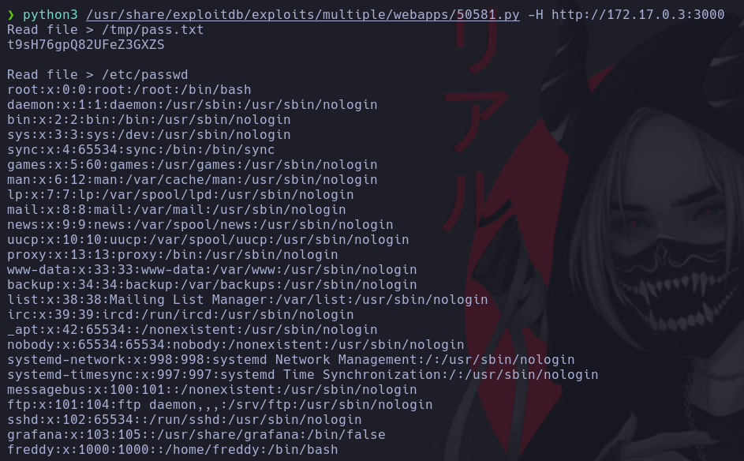

Con esto obtenemos credenciales válidas y nos conectamos por SSH.

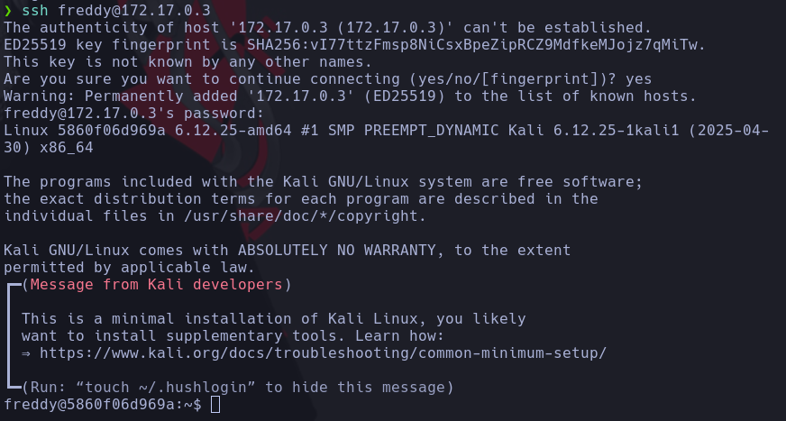

---

## ⬆️ Escalada de privilegios

Ejecutamos `sudo -l` para ver los binarios que se pueden ejecutar como root.

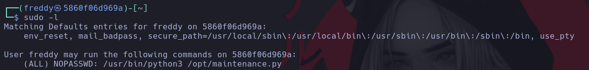

Se nos permite ejecutar `python3` sobre un archivo `.py` como cualquier usuario y sin contraseña. Para comprobar si podemos modificarlo o borrarlo, listamos sus permisos.

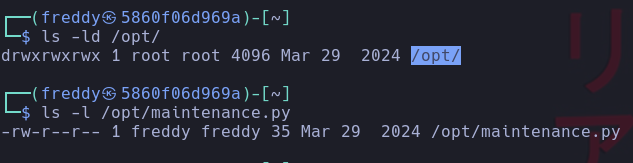

Confirmamos que tenemos permisos de escritura, así que editamos el script para ejecutar una reverse shell o simplemente abrir una shell como root.

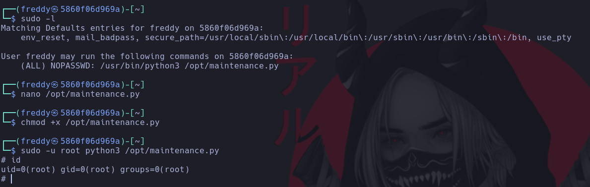

Máquina comprometida 🔓

## 🏁 Conclusión

En este reto hemos visto:

- Descubrimiento de servicios y rutas ocultas.
- Acceso a un panel de Grafana usando credenciales por defecto.
- Lectura de archivos sensibles desde una vulnerabilidad en Grafana.
- Escalada de privilegios editando un script con permisos y ejecutado con `sudo`.
