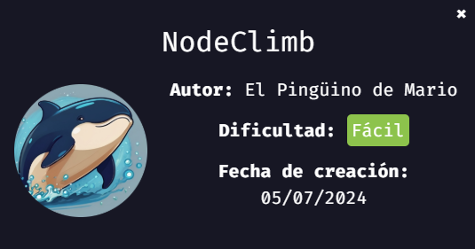
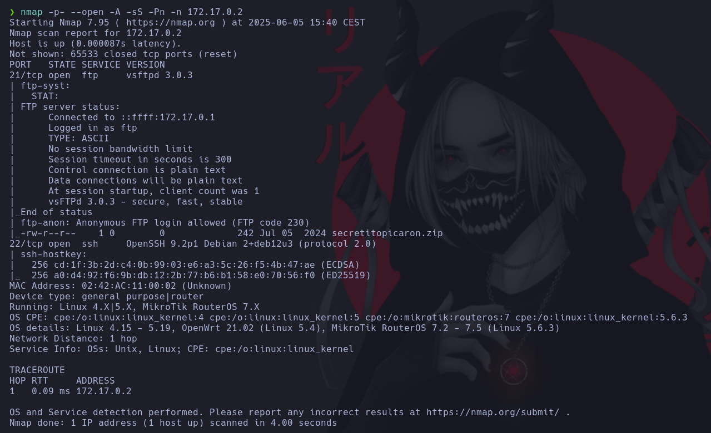
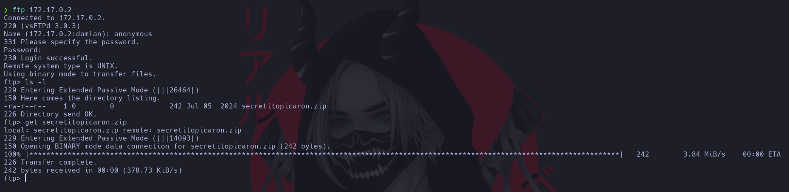
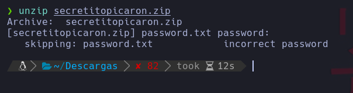
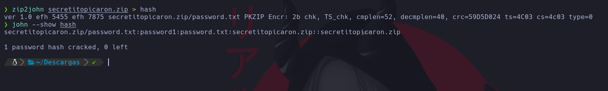
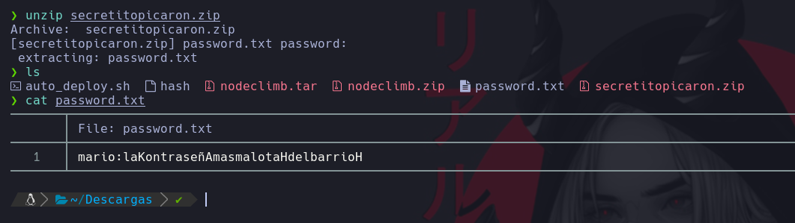
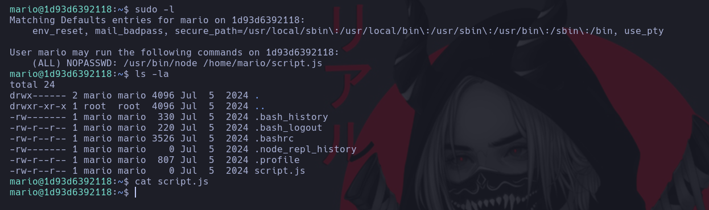
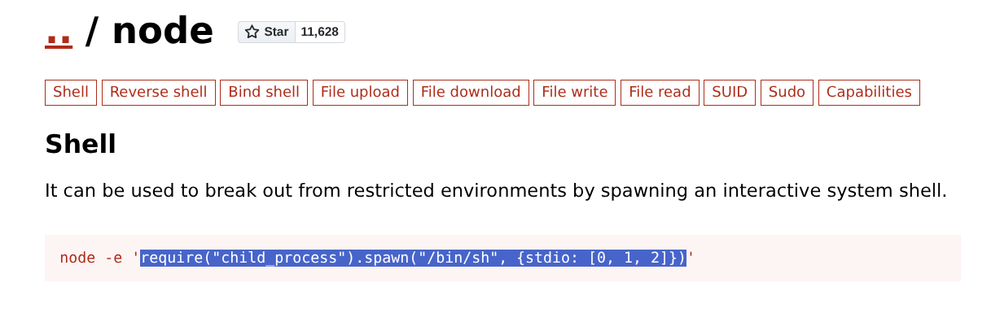
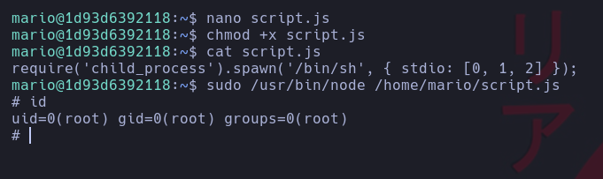

# 🚀 NodeClimb

> 💡 NOTA:  En mi [repositorio dockerlabs](https://github.com/damcorbor/dockerlabs/tree/main/comandos)  suelo ir dejando una lista con los comandos, herramientas y servicios que he ido usando durante los laboratorios, y los explico un poco por si alguien quiere repasarlos o usarlos como referencia.
---

## 🔍 Reconocimiento

Como siempre, lo primero es lanzar un `nmap` para ver qué puertos están abiertos en la máquina:



Nos encontramos con los puertos **21 (FTP)** y **22 (SSH)** abiertos. El puerto SSH lo dejamos de momento, porque sin credenciales no hacemos mucho... así que vamos directos al FTP.

El escaneo con `nmap` también nos dice que el FTP permite acceso **anónimo** y que hay un archivo dentro. Esto es gracias al parámetro `-sC`, que ejecuta scripts por defecto (como uno que comprueba acceso anónimo y enumera archivos si se puede). Muy útil.

---

## 💥 Explotación

Accedemos al FTP usando como usuario `anonymous` y sin contraseña. Listamos el contenido y encontramos el archivo que `nmap` nos había chivado. Nos lo descargamos:



Salimos del FTP y tratamos de descomprimir el `.zip` que nos bajamos:



Pero claro... el archivo está protegido con contraseña. Toca extraer el **hash** y hacerle un ataque de fuerza bruta con **john the ripper** .



Y vemos que la contraseña es `password1`.

Descomprimimos el archivo con esa pass:



Dentro encontramos un **usuario** y lo que parece ser su **contraseña** .

Probamos acceso SSH con esos datos y entramos. Una vez dentro, ajustamos el entorno para que la terminal vaya más fluida:

```
export TERM=xterm-256color  
export SHELL=/bin/sh  
source /etc/skel/.bashrc  
```

Hacemos un `sudo -l` y descubrimos algo jugoso: podemos ejecutar **node** como cualquier usuario (sí, **root incluido**) sobre un archivo `.js` que está en el home del usuario `mario`. 

Revisamos los permisos de ese script y vemos que tenemos permisos de escritura y además está vacío:



Vamos a lanzar una shell como root usando Node sobre un ``.js`` Si no sabes mucho de JS, no pasa nada: [GTFOBins](https://gtfobins.github.io/gtfobins/node/) tiene justo lo que necesitamos.



Editamos el script con `nano`, le damos permisos de ejecución, y lo lanzamos con sudo...



Máquina comprometida 🔓

---

## 🏁 Conclusión

En este reto hemos aprendido y practicado varias técnicas clave de pentesting:

- **Enumeración de servicios con Nmap**, descubriendo FTP accesible de forma anónima.
- **Acceso por FTP** y descarga de archivos sensibles, aprovechando malconfiguraciones comunes.
- **Ataque de fuerza bruta a ZIP protegido** con herramientas como *John the Ripper*.
- **Obtención de credenciales** que permiten acceso por SSH a un usuario real del sistema.
- **Escalada de privilegios mediante SUDO**, ejecutando Node.js con permisos de root.
- **Aprovechamiento de permisos de escritura** sobre scripts ejecutados como root.
