# 🤥 pequeñas-mentirosas

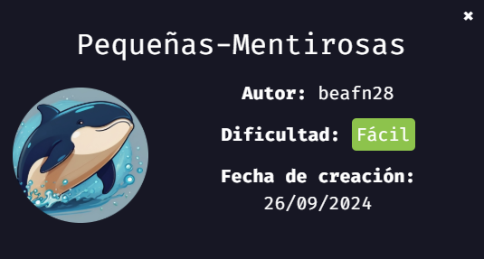
> 💡 NOTA:  En mi [repositorio dockerlabs](https://github.com/damcorbor/dockerlabs/tree/main/comandos)  suelo ir dejando una lista con los comandos, herramientas y servicios que he ido usando durante los laboratorios, y los explico un poco por si alguien quiere repasarlos o usarlos como referencia.
---

## 🕵️‍♂️ Reconocimiento

Lo primero que hacemos es un escaneo de puertos:

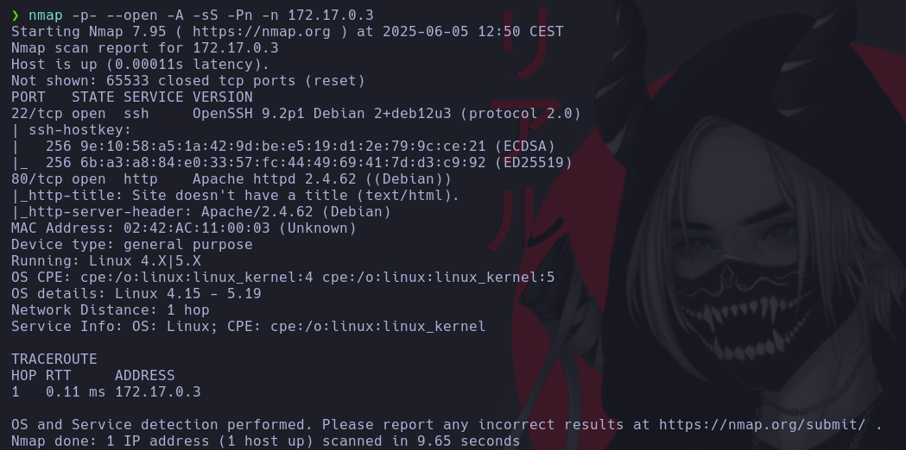

Vemos abiertos los puertos **80 (HTTP)** y **22 (SSH)**.

Como no tenemos credenciales para el 22, nos enfocamos en el puerto **80**.

Lanzamos un fuzzing web con `gobuster` para buscar directorios ocultos:

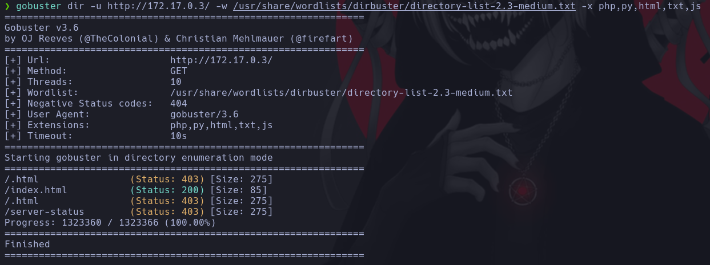

No aparece nada útil. He estado un rato buscando: revisando el código fuente, analizando los headers y tratando de ver si había alguna vulnerabilidad en las versiones.

En este punto se me ocurre que “**a**” podría ser un usuario válido del sistema.

---

## 💥 Explotación

Probamos fuerza bruta con `hydra` sobre SSH usando el usuario **a**:

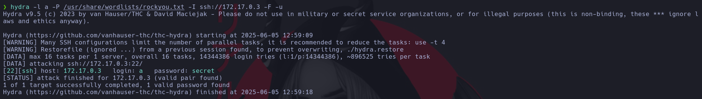

Y sí, obtenemos la contraseña: `secret`.

Nos conectamos por SSH:

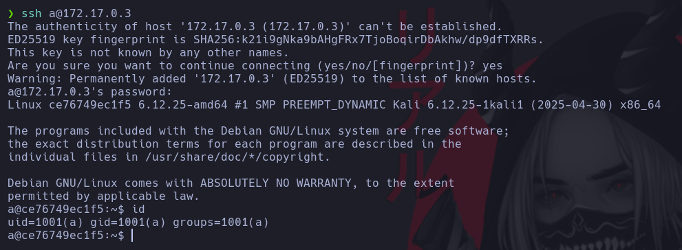

## 🔐 Escalada de privilegios

Primero preparamos un entorno cómodo (configuración de terminal) y probamos con: ``sudo -l`` para ver  qué binarios podemos ejecutar.

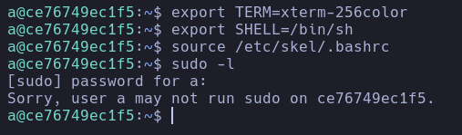

Vemos que el usuario **a** no tiene permisos sudo. Entonces, buscamos archivos con SUID activado:

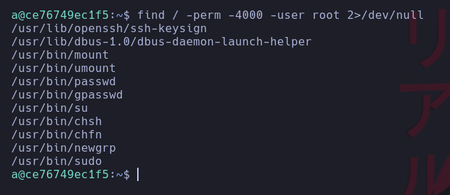

Nada interesante...

Pasamos a listar los usuarios del sistema:

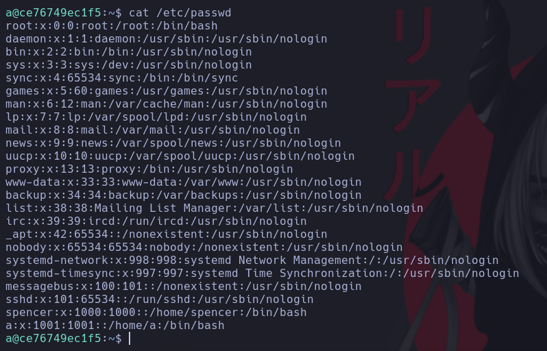

Vemos un usuario llamado spencer. Como nos funcionó antes, probamos fuerza bruta con hydra también para este usuario.

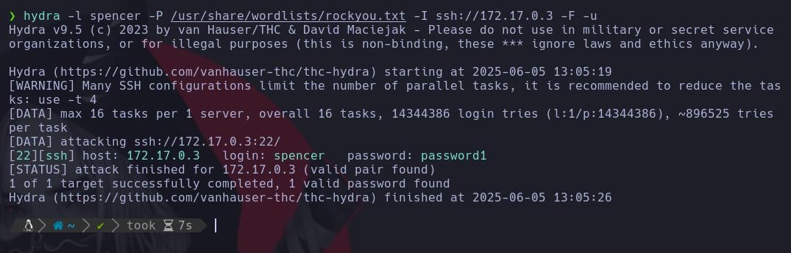

Éxito: la contraseña es ``password1``.

Con eso cambiamos de usuario: ``su spencer`` y luego revisamos los binarios con ``sudo -l``

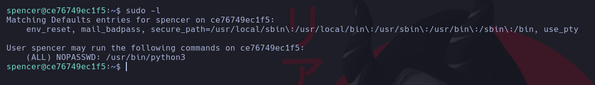

Perfecto. Puede ejecutar python3 como cualquier usuario, incluido root.

Como podems ejecutar python3 vamos a crear un script en Python para obtener una shell como root. No tenemos editores como nano o vim, así que usamos echo para escribirlo:

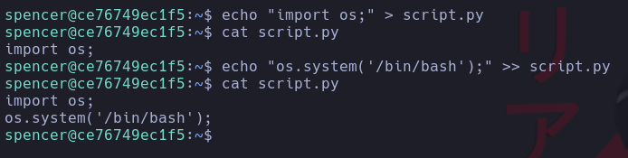

Y ejecutamos dicho ``.py`` con python3 para acceder como root.

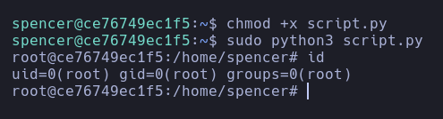

Máquina comprometida 🔓

---

## 🏁 Conclusión

En este reto hemos visto:

- Cómo realizar un reconocimiento básico mediante escaneo de puertos y fuzzing web.
- Cómo usar fuerza bruta con `hydra` para obtener acceso por SSH.
- Cómo listar usuarios del sistema y probar credenciales para realizar movimiento lateral.
- Cómo identificar binarios ejecutables con `sudo` y aprovechar `python3` para escalar privilegios hasta root.

