# 🧠 psycho

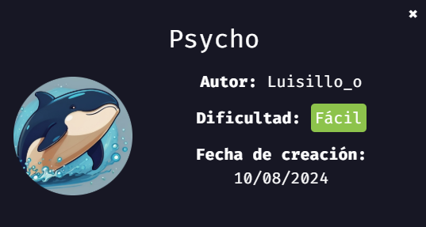
> 💡 NOTA:  Al final suelo dejar una lista con los comandos, herramientas y servicios que he usado durante el laboratorio, y los explico un poco por si alguien quiere repasarlos o usarlos como referencia.
---

## 🔎 Fase 1 - Reconocimiento

Para comenzar, lanzamos un escaneo de puertos con **nmap** para ver qué servicios están expuestos por la máquina.

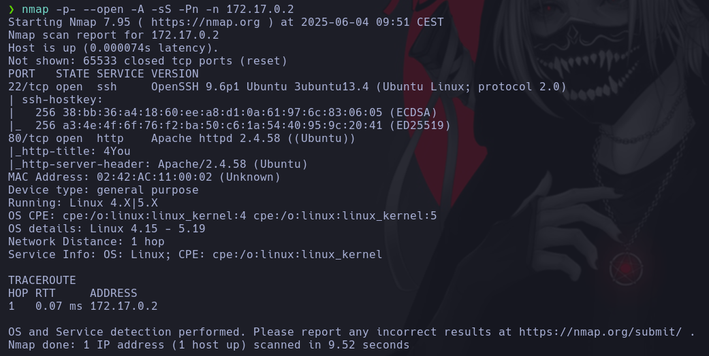

Se detectan los puertos **22 (SSH)** y **80 (HTTP)**.  
Sin credenciales no podemos hacer mucho con SSH, así que pasamos al puerto 80.

Lo primero que solemos hacer es un **fuzzing web** para encontrar directorios ocultos.

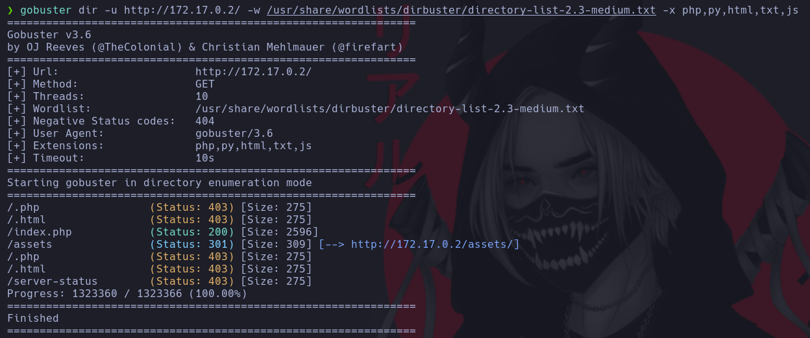

No aparece gran cosa, así que entramos directamente a la página principal: `index.php`.

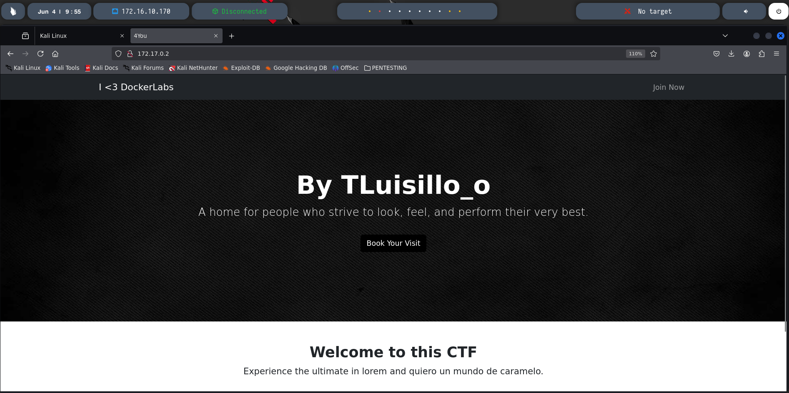

Como es habitual, miramos el código fuente de la web (Ctrl + U) para ver si hay comentarios sospechosos o algún dato útil.

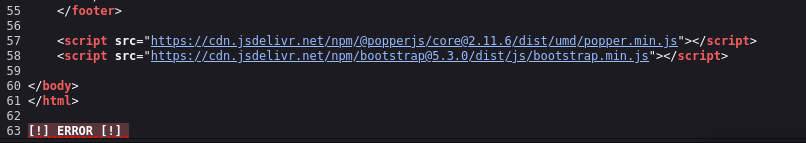

No encontramos nada especial, pero hay un **error visible** al final de la página, lo que sugiere que podría estar esperando un parámetro específico. Esto nos hace pensar en una posible **vulnerabilidad LFI** (Local File Inclusion), que básicamente permite leer archivos del sistema si un parámetro no está bien filtrado.

Probamos con un **fuzzing a parámetros** usando ffuf para ver si alguno activa esa vulnerabilidad.

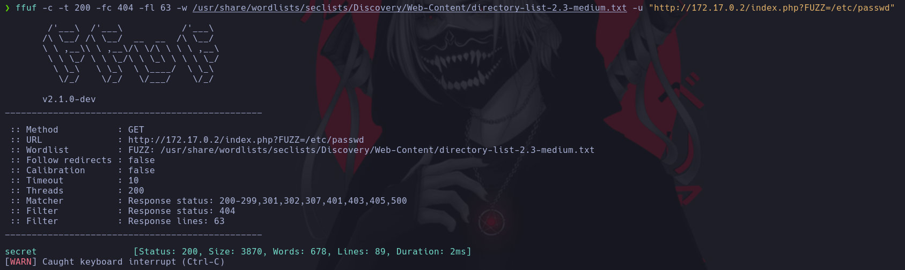

¡Bingo! Aparece un parámetro llamado `secret`.

---

## 💥 Fase 2 - Explotación

Con esto, accedemos al navegador y probamos añadiendo `?secret=` al final de la URL. Por ejemplo:
``
http://IP/index.php?secret=/etc/passwd
``

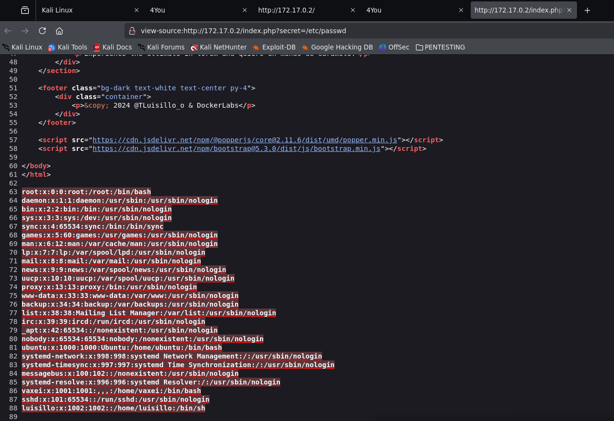

En el archivo `/etc/passwd` vemos que hay dos usuarios interesantes: **luisillo** y **vaxei**.

Volviendo al puerto 22, podríamos intentar un ataque de fuerza bruta... pero mejor buscamos algo más limpio. Vamos a ver si podemos acceder a la clave privada **id_rsa** de alguno de estos usuarios.

Probaremos con:
``
http://IP/index.php?secret=/home/vaxei/.ssh/id_rsa
``

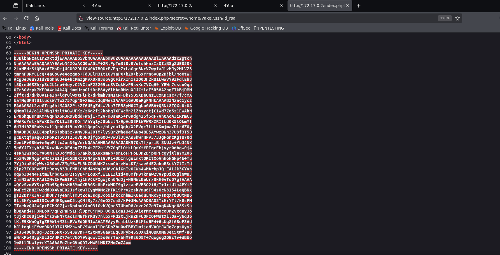

Conseguimos la clave privada de **vaxei**, la copiamos, la guardamos en un archivo, le damos permisos (`chmod 600`) y probamos acceder por **SSH**.

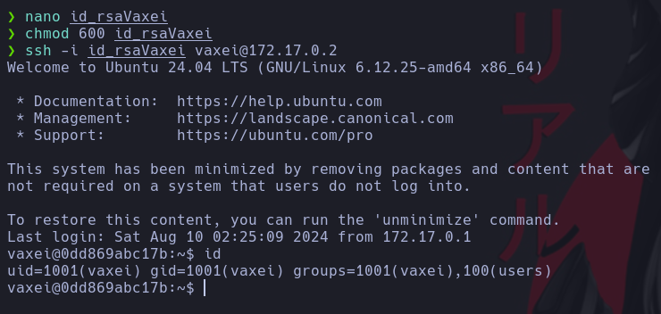

---

## 🧗 Fase 3 - Escalada de privilegios

Ya dentro de la máquina como usuario **vaxei**, toca escalar privilegios para tomar el control total.  
Lo primero es ver qué binarios podemos ejecutar con `sudo -l`.

Este comando nos muestra qué acciones podemos hacer con privilegios elevados.

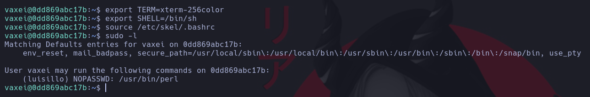

Además, ejecutamos una serie de comandos para que la terminal se vea mejor (export de TERM y SHELL, etc).

Según lo que nos permite `sudo`, podemos ejecutar **perl** como el usuario **luisillo**.  
Usamos [GTFOBins](https://gtfobins.github.io/) (página muy útil que muestra formas de escalar privilegios usando binarios comunes) para ver cómo explotar `perl`.

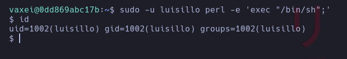

Una vez somos **luisillo**, hacemos otra vez `sudo -l`.

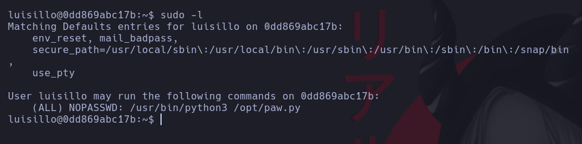

Nos dice que podemos ejecutar un script Python como **cualquier usuario**, incluso **root**.

Primero, revisamos los permisos del script original en `/opt`, ya que, si es posible modificarlo o eliminarlo para crear uno nuevo, podremos ahorrar trabajo.

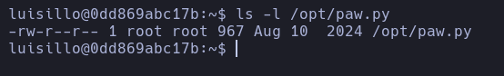

Vemos que no podemos modificar el `.py`, por lo que vamos a probar con los permisos del directorio padre. 

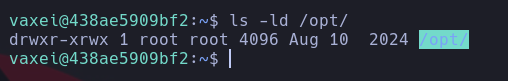

Vemos que **el directorio `/opt` es escribible**. Eso nos permite **borrar el script** y crear uno con el mismo nombre que nos dé una shell como root.

Creamos nuestro propio `paw.py` con el siguiente contenido:

```python
import os
os.system("/bin/bash")
```
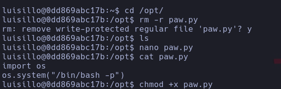

Ejecutamos el script usando sudo con el usuario root, y obtendremos acceso root completo.

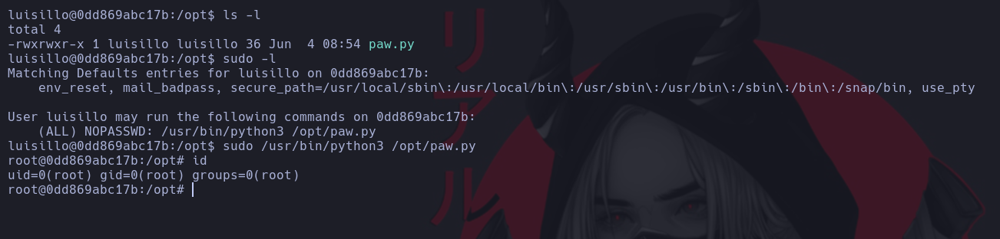

Máquina comprometida 🔓

---

## 🏁 Conclusión

En este reto hemos visto:
  
  - Cómo detectar y explotar una vulnerabilidad LFI.

  - Cómo escalar privilegios desde un usuario normal usando sudo + binarios vulnerables (perl).

  - Cómo hacer movimiento lateral a otro usuario (vaxei → luisillo).

  - Y cómo explotar permisos de escritura en un directorio para ejecutar un script como root.

<br><br><br><br><br><br><br><br><br><br><br><br><br><br><br><br>

## 🛠️ Herramientas, comandos y servicios usados

### 🔍 Nmap
```
nmap -p- --open -A -sS -Pn -n <IP>
Escanea puertos y detecta servicios.

    -p-: escanea todos los puertos.
    
    --open: muestra solo los puertos abiertos.
    
    -A: detección de sistema y versión.
    
    -sS: escaneo SYN, más sigiloso.
    
    -Pn: no hace ping previo.
    
    -n: no resuelve nombres DNS. 
```

### 🪓 Gobuster
```
gobuster dir -u http://<IP>/ -w /usr/share/wordlists/dirbuster/directory-list-2.3-medium.txt -x php,py,html,txt,js
Hace fuzzing para encontrar directorios o archivos ocultos.
    -w: diccionario.
    -x: extensiones que queremos probar.
```
###🏹 Ffuf
```
ffuf -c -t 200 -fc 404 -w /usr/share/wordlists/seclists/Discovery/Web-Content/directory-list-2.3-medium.txt -u "http://<IP>/index.php?FUZZ=/etc/passwd"
Fuzzing para probar parámetros o rutas.
    -fc 404: ignora errores 404.
    
    -t 200: usa 200 hilos (va más rápido).
    
    -u: URL con FUZZ donde se probarán los valores.
```

