# 🐧 Jenkins

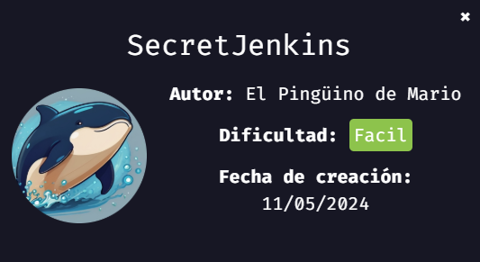
> 💡 NOTA:  En mi [repositorio dockerlabs](https://github.com/damcorbor/dockerlabs/tree/main/comandos) suelo ir dejando una lista con los comandos, herramientas y servicios que he ido usando durante los laboratorios, y los explico un poco por si alguien quiere repasarlos o usarlos como referencia.

## 🕵️ Reconocimiento

Comenzamos realizando un escaneo con **nmap** para ver qué puertos tiene abiertos.

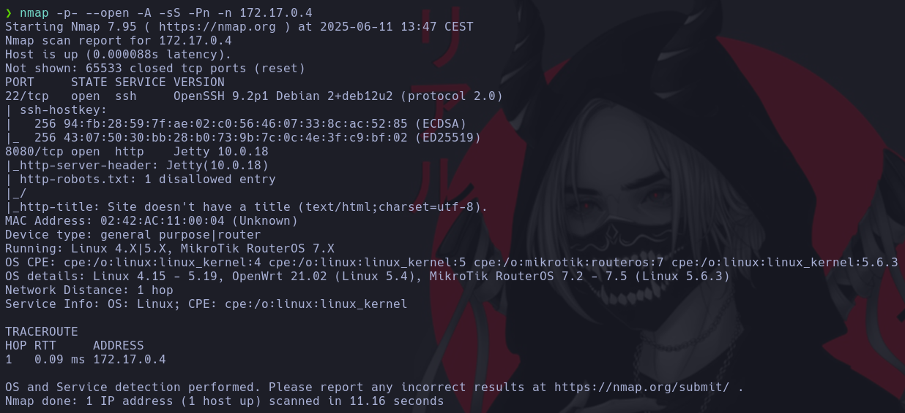

Como vemos, están abiertos los puertos **22 (SSH)** y **8080 (HTTP)**.

Sin credenciales, poco podemos hacer con SSH, así que nos dirigimos a la web por el puerto 8080.

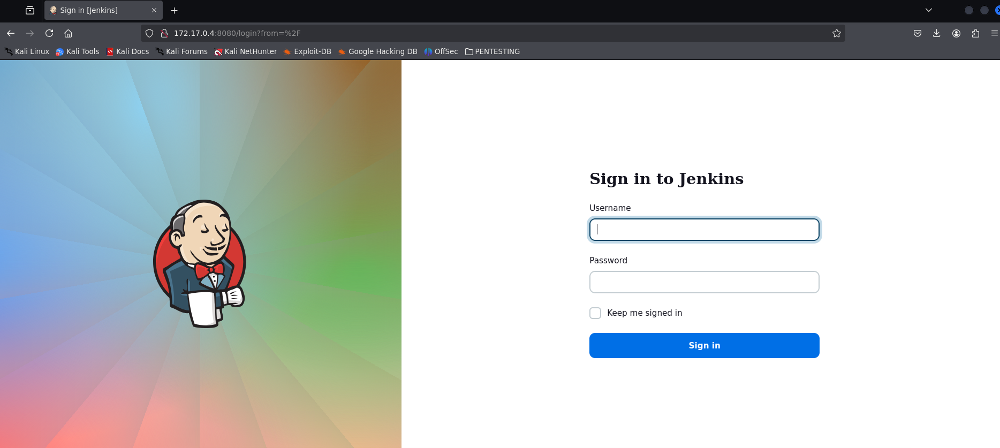

Nos redirige a un inicio de sesión. Probamos inyecciones SQL básicas, pero no funcionan. Revisamos también el código fuente y no se ve nada relevante.

Lanzamos un **whatweb** para identificar qué tecnología o versiones está usando la web.

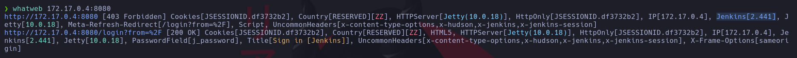

## 🚀 Explotación

Vemos que se trata de **Jenkins 2.441**, así que buscamos vulnerabilidades relacionadas con esa versión usando **searchsploit**.

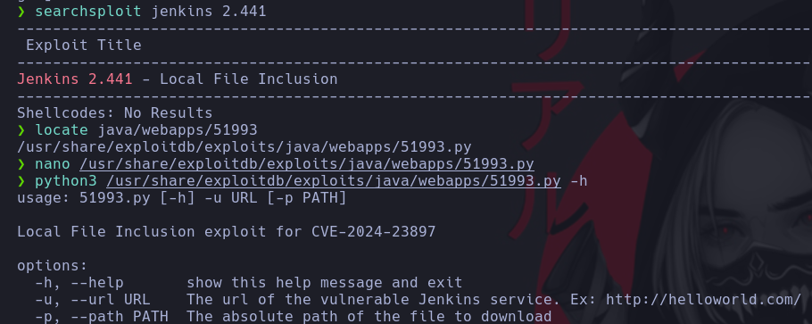

Encontramos un exploit que permite realizar **LFI** (Local File Inclusion). Lo ejecutamos para leer `/etc/passwd` y obtener usuarios válidos del sistema.

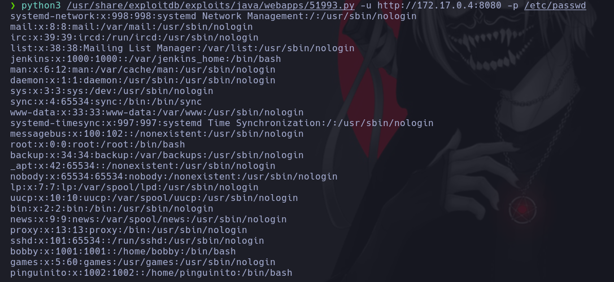

Obtenemos los usuarios `pinguinito` y `bobby`. Usamos un ataque de fuerza bruta con **Hydra** vía SSH para probar contraseñas y conseguir acceso.

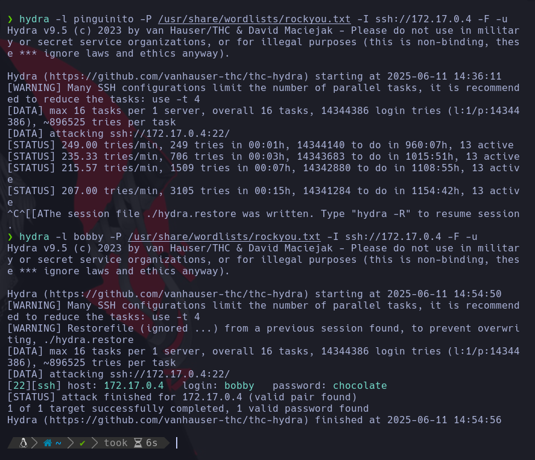

Conseguimos las credenciales de **bobby**, accedemos por SSH y realizamos el tratamiento habitual del terminal.

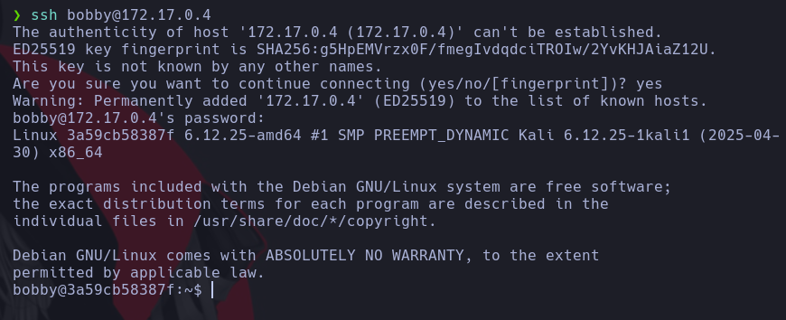

## ⬆️ Escalada de privilegios

Ejecutamos `sudo -l` para ver qué binarios podemos ejecutar.

Vemos que como **usuario pinguinito** y **sin contraseña**, se puede ejecutar `python3`. Creamos un pequeño script para aprovechar esto. Como no hay ni `nano` ni `vim`, usamos `echo` para generar el archivo directamente.

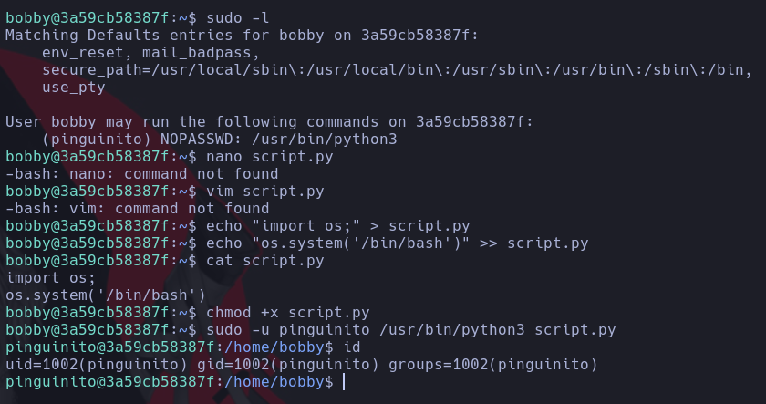

Una vez dentro como `pinguinito`, volvemos a ejecutar `sudo -l`.

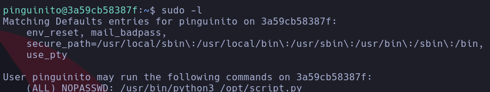

Ahora podemos ejecutar `python3` sobre un archivo `.py` en `/opt` como **cualquier usuario**. Comprobamos los permisos tanto del archivo como del directorio padre.

Al tener permisos de escritura, borramos el script y creamos uno nuevo en la misma ruta con el mismo nombre, nuevamente con `echo`, para ejecutar una shell como **root**.

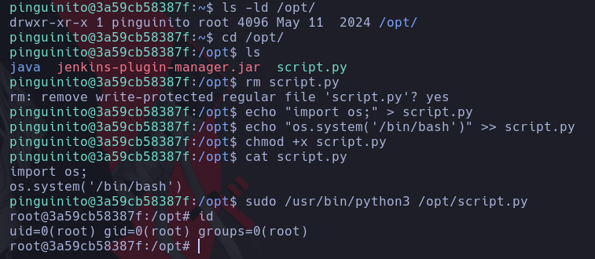

¡Máquina comprometida! ✅

## 🏁 Conclusión

En este reto hemos visto:

- Identificación de servicios y versiones mediante `nmap` y `whatweb`.
- Búsqueda y uso de vulnerabilidades públicas (LFI en Jenkins).
- Ataques de fuerza bruta sobre SSH para obtener acceso inicial.
- Escalada de privilegios en dos fases, primero pivotando de un usuario a otro, y luego aprovechando permisos en scripts modificables.
