# 📤 Upload

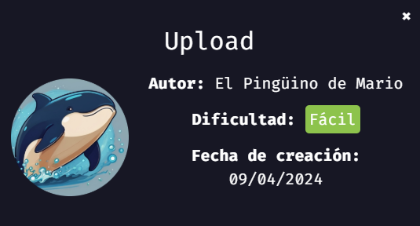
> 💡 NOTA:  En mi [repositorio dockerlabs](https://github.com/damcorbor/dockerlabs/tree/main/comandos)  suelo ir dejando una lista con los comandos, herramientas y servicios que he ido usando durante los laboratorios, y los explico un poco por si alguien quiere repasarlos o usarlos como referencia.
---

## 🕵️ Reconocimiento

Empezamos lanzando un escaneo con **nmap** para identificar puertos y servicios activos.

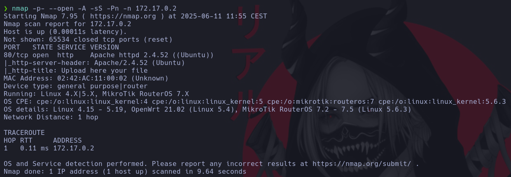

Solo se encuentra abierto el puerto **80 (HTTP)**. Al acceder desde el navegador, aparece una página con funcionalidad para subir archivos.

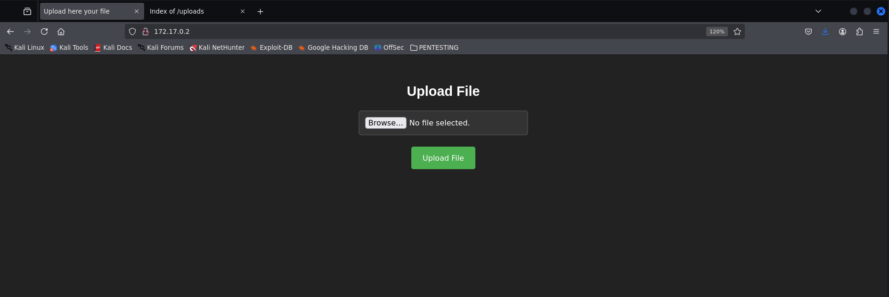

Realizamos un **gobuster** para detectar rutas ocultas. Buscamos principalmente directorios donde puedan guardarse los archivos subidos.

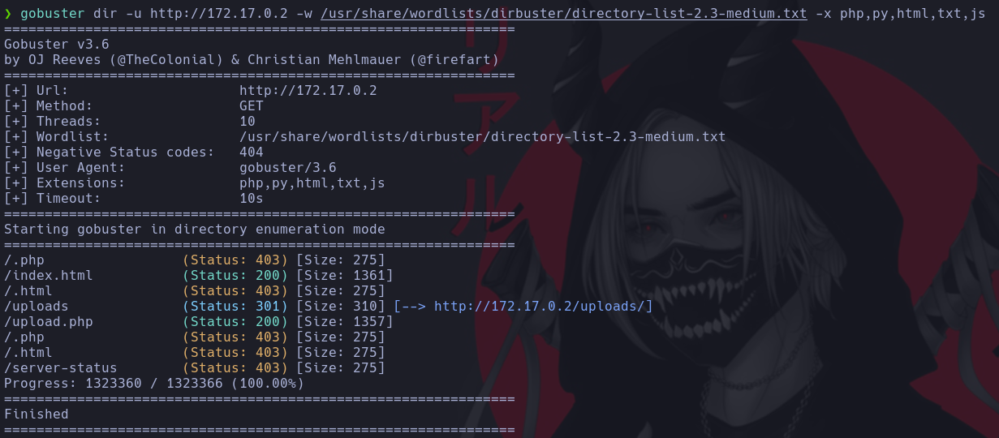

Se descubre un directorio llamado `/uploads`, así como un `upload.php`, que al parecer redirige a lo mismo que `index.html`. Todo apunta a que la idea es aprovechar esta subida para ejecutar una **reverse shell** a través de un archivo `.php`.

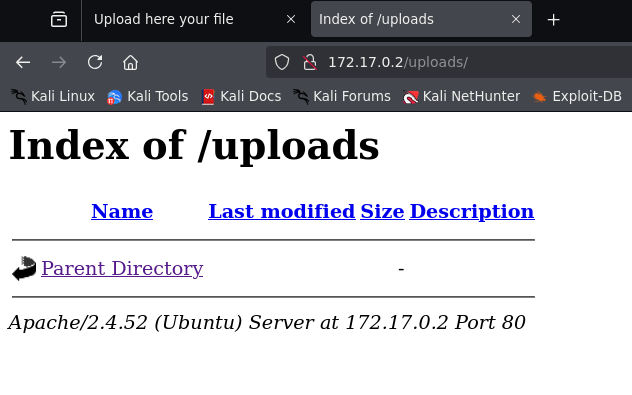

## 💥 Explotación

Preparamos un archivo `.php` con una shell básica que nos permita ejecutar comandos desde la URL mediante un parámetro.

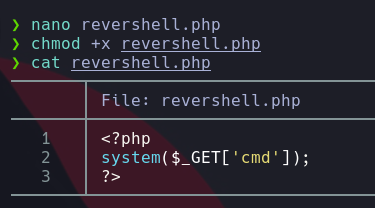

Subimos el archivo con éxito.

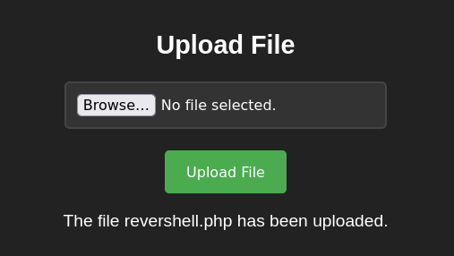

Después, accedemos al archivo subido en `/uploads`, usando el parámetro necesario (`cmd`) para activar la reverse shell.

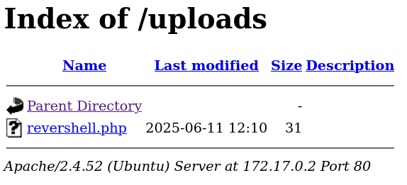  
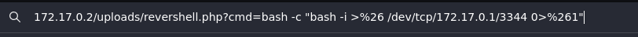

Al recibir la conexión, ya estamos dentro del sistema.

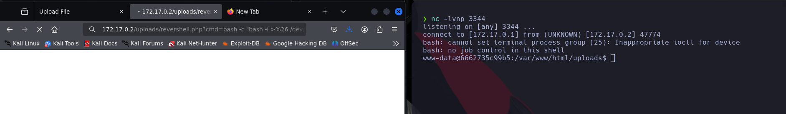

Ajustamos la terminal con tratamiento de TTY para trabajar mejor.

## ⬆️ Escalada de privilegios

Ejecutamos `sudo -l` para ver qué binarios pueden usarse con privilegios elevados.

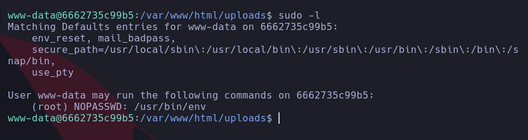

Se puede ejecutar el binario **env** como **root** sin necesidad de contraseña. Con ayuda de **GTFOBins**, aprovechamos esta funcionalidad para escalar privilegios.

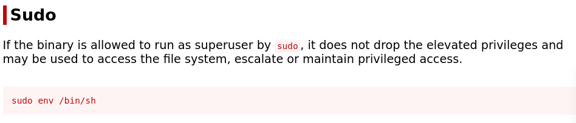

Con esto conseguimos acceso como **root**.

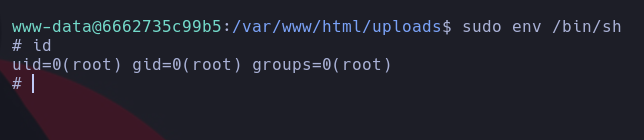

Máquina comprometida 🔓

## 🏁 Conclusión

En este reto hemos visto:

- Subida de archivos maliciosos a un servidor vulnerable.
- Ejecución remota de comandos mediante una reverse shell en PHP.
- Escalada de privilegios utilizando el binario **env** ejecutado como root.
